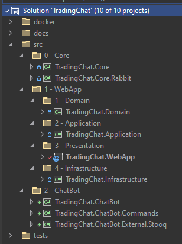

# Trading Chat

## Environment

- PostgreSQL
- Seq
- RabbitMQ

cd to `docker` folder in the root of the solution. 

### Environment (postgres, seq)
```
docker-compose -f .\docker-compose.env.yml up -d
```

### Environment + WebApp + ChatBot

```
docker-compose -f docker-compose.yml -f docker-compose.env.yml up -d --build
```

## How it works?

- The user can register and login in the website.
- The user can create a new chat room.
- The user can join a existing chat room.
- The user has the option to send commands to the chat, if it is a valid command
the bot will respond.

When the user joins a chat room, the client connects to the SignalR Hub (Chat/Hub) for 
sending and receiving messages in real time, once the user is connected, he joins the SignalR group
of the ChatRoom.

When a message is sent, it will be validated and saved in the database. If it starts with a `/`,
it's enqueued in the `ChatCommand` queue.  

There is a ChatBoot Worker that consumes this queue and tries to find a handler to that command,
if no handler is found, nothing happens. If the handler is found, the command will be processed.

Regardless if the command has been processed successfully or with an error, a response message is 
enqueued in the `ChatMessage` queue.

Back in the WebApp project, there is a background service consuming this queue, and sending 
the response message to `ChatHub`, where it will be broadcasted to all the users connected to
that chat.

## Architecture



The solution is divided in 3 main layers, in a production cenario it would be better 
to separete each of this in it's own git repository, so i built in a way that they are decoupled. 

- Core
- WebApp
- ChatBot

### Core

In a real productive environment, this Core projects should be distributed as Nuget Packages,
and used by the other projects. It is responsible for:

- Result and Error wrappers
- Abstractions and implementations for messaging
- Messages contracts

The core does not depend on any other layer.
___

### WebApp

The WebApp is composed with the projects related to the Front/Backend.
It has authentication and authorization with ASP.NET Identity,

I opt to build it with 4 layers of responsability, following the Clean Archtecture principles:

#### Domain

The Domain layer is at the center of the solution, responsible for the entities and its rules.

- Contracts
- Entities

#### Application

The Application layer depends on the Domain layer, and is responsible for the application
business rules.

It uses the MediatR package for handling the requests and handlers, and the FluentValidation package
for validations. It has also a validation pipeline for auto-validating all the requests that passes
throught mediator.

More about MediatR, CQRS and Pipelines Behavior in my [EasyCqrs Repo](https://github.com/tuliopaim/EasyCqrs).

- Use cases (commands and queries)

#### WebApp

The WebbApp layer is our front/back end, built with ASP.NET Core MVC, bootstrap and jquery.
For the real time communication in the Chats, i used the SignalR package.

- Views
- Controllers
- SignalR Hub

#### Infrastructure

The Infrastructure layer is responsible for the database access, with EntityFramework Core. 

- EF Core 
	- DbContext, Mappings, Migrations, Repositories
- Dependency Injection
- Startup Services 
	- Queues and Bot User creation for dev and internal environment

___

### ChatBot

The Chat Bot is a worker service that consumes from a RabbitMQ queue for processing chat commands.
It's divided in 3 layers of responsability:

- ChatBot
- Commands
- External.Stooq

#### ChatBot

The ChatBot layer is the WorkerService that consumes the ChatCommand queue and passes it to the 
`ChatMessageCommandInvoker`, present in the Commands layer.

#### Commands

The Commands layer is a place for implementing support for the commands. I built it in a way that
to support antoher command, you only need to implement the `IChatMessageCommand` and inject it, 
completed decoupled from the WebApp solution.

A command is a message that starts with `/`.
Currently it supports the **stock price** command and the **ping pong** command.

- `/stock={stockcode}` - Bot respond with informations of the stock price.
- `/ping` - Bot respond with a `pong`.

#### External.Stooq

The External Stooq layer is the adapter to communicate with the Stooq API that provides stock
price information.

___

## Roadmap

- [x] Docker Compose with Postgres and Rabbit
- [x] MVC WebApp with Identity and Seq
- [x] ChatRoom
	- [x] Create and List
	- [x] Join Chat
	- [x] Send and receive messages with SignalR
- [x] Trading Bot
	- [x] Rabbit Structure
	- [x] Get stock price in Stooq 
	- [x] Multiple ChatCommands support
- [x] Dockerize everything
- [x] README
- [ ] More unit tests
